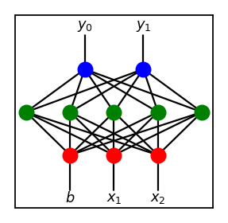
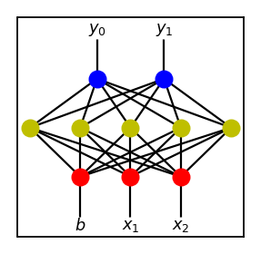
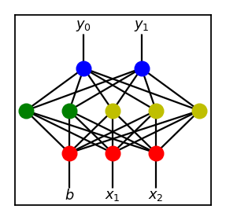
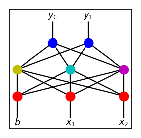
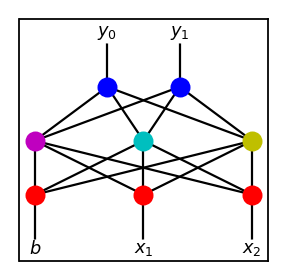
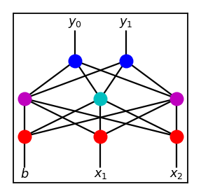
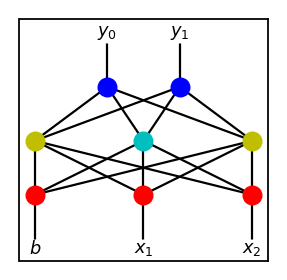

# Flappy Bird Clone with NEAT

This project was inspired by
[this paper.](http://nn.cs.utexas.edu/downloads/papers/stanley.ec02.pdf)
This is my own take on neuroevolution borrowing many ideas presented in the
paper. This is just the first small project for implementing the idea from
scratch, and not everything is implemented to its full extent. Its possible
shortcomings and improvements will be discussed below.

Use `python game.py` to run the game normally, or `python game.py neat`
to run it with NEAT AI. Dependencies include `numpy` and `pygame` with
versions `1.16.2` and `1.9.4` used respectively when building the project.

I strongly recommend to anyone interested to follow the link and read the paper
as most of the material does not require extensive expertise and concepts are
clearly explained.

## Introduction

One of the biggest roadblocks to training an artificial neural network (ANN)
is determining the proper topology of the network. If the size of the network
is too small, then it cannot solve the problem. On the other hand, if the size
of the network is too large, search for the solution becomes too slow as
the computational power required grows exponentially relative to the size
of the network.

Finding the right network structure for the job at hand is often part of the
most time consuming process in dealing with ANNs. Starting with a wrong network
structure, tuning of other hyperparameters, such as deciding learning rate,
batch optimization, weight initialization, etc., each of which is associated
with numerous variables to tune, becomes wasted labor.

In the field of machine learning (ML), whatever the problem at hand may be,
under the hood, the main goal is to automate the process of finding the right
variables. For example, at the lowest level, this is finding the right weight
matrices via gradient descent. At a higher level, we often see other examples
where a variety of adaptive algorithms are utilized. An algorithm that
searches for the right topology on its own could then be considered as
automation at the highest level, and could become an indispensable tool for ML
with ANNs.

## TWEANN, Neuroevolution, and NEAT

Topology and weight evolving artificial neural network (TWEANN), as its name
suggests, is a type of ANN where it learns to decide what the optimal topology
for itself is on top of finding the right weights in the network.
In light of this new terminology, classical ANNs then could be considered as
weight evoloving aritificial neural network.

TWEANN is an encompassing term for any ANN evolving both its topology and
weights. Hence, there are many different kinds of TWEANN that can be found
in the literature. Now, neuroevolution is a type of TWEANN where an evolutionary
algorithm, or more commonly known as genetic algorithm (GA), is employed to
find the right ANN. In short, neuroevolution trains a batch of ANNs and then
creates a new generation of ANNs from the previous ones by breeding and mutating
ANNs.

How to go about evolving ANNs via GA then becomes the main focus of developing a
neuroevolution algorithm. Under such scheme, ANN is often referred to as
a genome. In any case, neuroevolution of augmented topologies (NEAT), cited
at the very beginning, is a proposed solution to this problem. Main ideas
of NEAT include genetic encoding (encoding the structure of ANN as a collection
of node genes and connection genes), historical markings (keeping track of
the history of genes), protection of innovation through speciation
(protecting newly mutated genome), and incremental growth from minimal structure
(to minimize the size of the structure).

The first three of the four main ideas are all tied with the concept of
crossovers in an effort to solve the competing conventions problem. Although
I won't go into any details about how these ideas are implemented in the paper,
I'll go over crossovers and the competing conventions problem as it will be
discussed later on.

## Crossovers

Conceptually, a crossover refers to a breeding of two parent genomes such as
```
AAAAAAAAAAA

BBBBBBBBBBB
```
to produce children of the following forms.
```
AAABBBBBBBB

BBBAAAAAAAA
```
The shared index of the genomes where they are sliced is called the crossover
point.

Now, let's consider the following two networks.




Suppose, we want to produce a child network that inherits its features from
its parents. Perhaps the most naive way to go about this is to create a
child with the same network structure as the two above and randomly copying
edge weights from either parent with equal probability of 0.5. This would
be a bad for the following reason. 

If parents were already trained to some extent, then each hidden node
represents some feature of the network by meaningfully combining the
values from the previous layer. If we take a hidden node from each parent
at the same position and mix up the weights connected to it, there is no
reason why the resulting node should be helpful.

However, if we were to breed these two using a crossover, we can get
something much more sensible like this.



## Competing Conventions Problem

Although in the example above, we have "cut" the parents vertically,
this is usually not the best way to perfrom crossovers. Consider
another pair of parents below.




Despite being in different locations, nodes with the same color represent
the same feature, that is, associated weights are the same. If all three
features are crucial in solving the problem, this situation may arise naturally
for various reasons, such as differing initial weights.

In any case, if we breed these two via crossover akin to the one used above,
we get the following unsatisfying results.




Both children are missing a crucial component and result in dead ends
for the evolutionary process.

There is no easy solution to this problem but various methods have been
proposed to mediate this issue as much as possible. Usually this envolves
encoding the network structure in a certain way, such that either the cases like
above don't arise naturally during the evolutionary process or crossovers
themselves do not produce such undesirable results.

Basically, in the paper cited above, genetic encoding and historical markings
are used to enable crossover breeding of genomes that helps to avoid the
competing conventions problem.

## NEAT for Flappy Bird Clone

NEAT used in this project is a simplified version of the original, hence
does not implement all the ideas to their fullest extent found in the paper.
Below is the analysis of NEAT made for this project.
