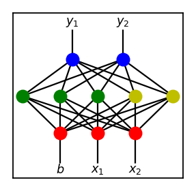
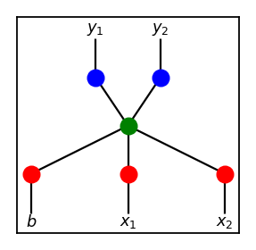
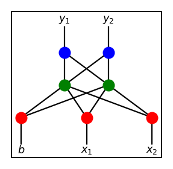

# Flappy Bird Clone with NEAT

This project was inspired by
[this paper.](http://nn.cs.utexas.edu/downloads/papers/stanley.ec02.pdf)
This is my own take on neuroevolution borrowing many ideas presented in the
paper. This is just the first small project for implementing the idea from
scratch, and not everything is implemented to its full extent. Its possible
shortcomings and improvements will be discussed below.

Use `python game.py` to run the game normally, or `python game.py neat`
to run it with NEAT AI. Dependencies include `numpy` and `pygame` with
versions `1.16.2` and `1.9.4` used respectively when building the project.

I strongly recommend to anyone interested to follow the link and read the paper
as most of the material does not require extensive expertise and concepts are
clearly explained.

## Introduction

One of the biggest roadblocks to training an artificial neural network (ANN)
is determining the proper topology of the network. If the size of the network
is too small, then it cannot solve the problem. On the other hand, if the size
of the network is too large, search for the solution becomes too slow as
the computational power required grows exponentially relative to the size
of the network.

Finding the right network topology for the job at hand is often part of the
most time consuming process in dealing with ANNs. Starting with a wrong network
topology, tuning of other hyperparameters, such as deciding learning rate,
batch optimization, weight initialization, etc., each of which is associated
with numerous variables to tune, becomes wasted labor.

In the field of machine learning (ML), whatever the problem at hand may be,
under the hood, the main goal is to automate the process of finding the right
variables. For example, at the lowest level, this is finding the right weight
matrices via gradient descent. At a higher level, we often see other examples
where a variety of adaptive algorithms are utilized. An algorithm that
searches for the right topology on its own could then be considered as
automation at the highest level, and could become an indispensable tool for ML
with ANNs.

## TWEANN, Neuroevolution, and NEAT

Topology and weight evolving artificial neural network (TWEANN), as its name
suggests, is a type of ANN where it learns to decide what the optimal topology
for itself is on top of finding the right weights in the network.
In light of this new terminology, classical ANNs then could be considered as
weight evoloving aritificial neural network.

TWEANN is an encompassing term for any ANN evolving both its topology and
weights. Hence, there are many different kinds of TWEANN that can be found
in the literature. Now, neuroevolution is a type of TWEANN where an evolutionary
algorithm, or more commonly known as genetic algorithm (GA), is employed to
find the right ANN. In short, neuroevolution trains a batch of ANNs and then
creates a new generation of ANNs from the previous ones by breeding and mutating
ANNs.

How to go about evolving ANNs via GA then becomes the main focus of developing a
neuroevolution algorithm. Under such scheme, ANN is often referred to as
a genome. In any case, neuroevolution of augmented topologies (NEAT), cited
at the very beginning, is a proposed solution to this problem. Main ideas
of NEAT include genetic encoding (encoding the structure of ANN as a collection
of node genes and connection genes), historical markings (keeping track of
the history of genes), protection of innovation through speciation
(protecting newly mutated genome), and incremental growth from minimal structure
(to minimize the size of the structure).

The first three of the four main ideas are all tied with the concept of
crossovers in an effort to solve the competing conventions problem. Although
I won't go into any details about how these ideas are implemented in the paper,
I'll go over crossovers and the competing conventions problem as it will be
discussed later on.

## Crossovers

Conceptually, a crossover refers to a breeding of two parent genomes such as

    AAAAAAAAAAA

    BBBBBBBBBBB

to produce children of the following forms.

    AAABBBBBBBB

    BBBAAAAAAAA

The shared index of the genomes where they are sliced is called the crossover
point.

Now, let's consider the following two networks.

Suppose, we want to produce a child network that inherits its features from
its parents. Perhaps the most naive way to go about this is to create a
child with the same network structure as the two above and randomly copying
edge weights from either parent with equal probability of 0.5. This would
be a bad for the following reason. 

If parents were already trained to some extent, then each hidden node
represents some feature of the network by meaningfully combining the
values from the previous layer. If we take a hidden node from each parent
at the same position and mix up the weights connected to it, there is no
reason why the resulting node should be helpful.

However, if we were to breed these two using a crossover, we can get
something much more sensible like this.

## Competing Conventions Problem

Although in the example above, we have "cut" the parents vertically,
this is usually not the best way to perfrom crossovers. Consider
another pair of parents below.

Despite being in different locations, nodes with the same color represent
the same feature, that is, associated weights are the same. If all three
features are crucial in solving the problem, this situation may arise naturally
for various reasons, such as differing initial weights.

In any case, if we breed these two via crossover akin to the one used above,
we get the following unsatisfying results.

Both children are missing a crucial component and result in dead ends
for the evolutionary process.

There is no easy solution to this problem but various methods have been
proposed to mediate this issue as much as possible. Usually this envolves
encoding the network structure in a certain way, such that either the cases like
above don't arise naturally during the evolutionary process or crossovers
themselves do not produce such undesirable results.

Basically, in the paper cited above, genetic encoding and historical markings
are used to enable crossover breeding of genomes that helps to avoid the
competing conventions problem.

## NEAT for Flappy Bird Clone

NEAT used in this project is a simplified version of the original, hence
does not implement all the ideas to their fullest extent found in the paper.
Below is the analysis of NEAT made for this project.

## Basic Idea

With specified number of input variables and output variables, we start with
a single hidden node and additional bias node for the input layer. For example,
if the number of inputs and outputs is 2, we start with the following
topology.

During the initial phase, we generate a whole population of genomes, i.e.
bunch of ANNs with the same topology as above, initialized with random weights,
and let each genome play the game. Once every genome receives a score,
we then create the next generation of genomes from the previous generation.
Some genomes with best scores are kept for the next generation. Some are
mutated by randomly perturbing its weights. The rest are bred by mixing weights,
as usage of crossovers do not make much sense yet since there is only one
hidden node per genome.

This is repeated for some set time to let genomes optimize as much as possible
under the current given topology. Each population (batch of genomes) is given
generation number, and once the generation number passes certain threshold,
we introduce an extra hidden node to certain proportion of the population.

When breeding genomes with at least one of the parents with more than one node,
we use crossovers as explained before (i.e. cutting the networks vertically).
If the topologies do not match, we simply append the additional structure
to the smaller one. That is, combining the two below

results in the following child.

Once extra nodes are introduced into the population, as breeding via crossovers
and mutation via perturbations preserves the number of hidden nodes, eventually,
the entire population is replaced by genomes with two hidden nodes (unless a
genome with simpler structure continues to outperform all other genomes
and is kept through generations).

## Discussion

One can easily find an example of an implementation of AI learning to play
flappy bird clones. There are indeed rather abundant amount of such examples
on github, youtube, etc. In this section, I try to make a case of why
this project is at least somewhat different. The goal wasn't simply to beat
a flappy bird clone but to get a deeper insight into how NEAT works.

### Flappy Bird is Too Easy to Solve

As a human player, flappy bird isn't particularly thought demanding game.
The logic is very simple. One looks ahead for the next hole, and if the bird
is too low, you jump. If the bird is too high, you let it fall until the
position of the bird becomes too low compared to the position of the hole.

With this in mind, if the variables such as distance between walls and
size of holes are set generously, the game can be learned with an ANN
with the following topology.

As node b is for bias, this ANN only takes in x1 from the game and decideds
whether to jump or not. For x1, we can simply give the height difference
between the bird and center of the next hole. And yes, I have tried this
and it was successful.

### Is Flappy Bird Really That Easy?

However, there are several problems with the above approach. One that is more
readily noticable from the picture above is that this is essentially
equivalent to solving a linear equation. Although it is nice to see
ANN figure out the proper associated constants (weights that is), we really
don't need fancy ANN implemented for such a simple task.

The bigger problem that is harder to notice is that one responsible for
designing such algorithm is essentially *inadvertently solving the problem for
the AI during the preprocessing stage.* Although preprocessing of data is
necessary for solving the majority of problems in this field, as we are often
limited by small amount of resources (computing power) compared to the
vast dimensionality of the solution space to search for, doing this for such
a simple game as flappy bird gives us little to no insight into how an ANN
works.

I would say since flappy bird is rather a simple game, we have a good
oppertunity to tease out these inadvertant preprocessing part and try to
come up with an algorithm that is more general and is in accordance with
the goal of NEAT.

### Let's Make Flappy Bird Harder for Computers

When a player *decides* to look for the next hole, a decision has been made
about which wall to look for (pipes in case of the original game). We ignore
the one behind the bird, and look for the one in front of the bird. This
seemingly simple task is already dealing with three variables, making
comparisons, and deciding what to use and what not to.

Similarly, when we give the height difference between the bird and the hole as
an input value, we are doing the arithmetics work for the computer.

Additionally, we can throw in the y velocity value of the bird as one
of input values, even though it is not relavent in beating the game,
just to see if the algorithm learns to ignore it.

With all this in mind, we can start with a structure something like below.

### Details on Implementation

Implementation is done pretty straightforwardly. Even with further increase in
structural complexity, we only get simple fully connected feed foward networks
like below.

The hidden layer uses relu and the output layer (or rather node in this case)
uses step function as activation in current implementation.

### Necessity of NEAT

Before moving on with NEAT, we do need to consider beforehand whether
the problem of beating the game has actually gotten harder. Although
the search space has expaneded in terms of its size and dimension,
if the solution space can be expressed as a single linear inequality of the form

$$
    w_{0} \cdot b + w_{1} \cdot x_{1} + ... + w_{6} \cdot x_{6} > c
$$

then the above starting structure would be sufficient and there is no need
for NEAT to evolve topological complexity any further.

Long story short, we now need a network capable of solving XOR problems, so
the topology of ANNs must grow at some point to accomodate this.

### Topological Sufficiency Single Hidden Layer

Even without adding additional layers, if enough number of hidden nodes
are added, any solution space can be approximated within any $\epsilon$ margin.
This is due to the
[universal approximation theorem.](https://en.wikipedia.org/wiki/Universal_approximation_theorem)

Without going into full detail, let's see how this might work on the simplest
possible case. Consider the following simplest possible ANN structure with
relu and step activation for hidden and output nodes respectively.

This network can solve any step function of the form appearing on the right
where a is an arbitrary constant (in fact, the network can also solve the
non-increasing version going from 1 to 0 with a single step).

Similarly, the network on the left can solve any step function of the
form on the right in the diagrams below (again, the function also may go
from 1 to 0 back to 1).

It is then not hard to see that a network only with more hidden nodes
that can solve something more complicated like below (that is,
with at least 8 nodes to be exact).

We can now easily see that with enough hidden nodes, any function

$$
f: \mathbb{R} \rightarrow \{0, 1\}
$$

can *solved* if $f$ has only finite number of steps.

### What is Happening Under the Hood

Note that there is no mention of backpropagation so far. Although being
*the staple method* for solving problems with ANNs, it isn't used here.
Since this is a kind of unsupervised learning, it is not obvious how
backpropagation can be employed as we don't have the labels for the outputs
we get during the process.

Then how does the algorithm know how to "climb up" its score surface
via seemingly performing gradient descent? Well, the short answer is that
it isn't doing any gradient descent, at least not by computing
the gradient beforehand. Let's go back to the basics.

### Learning about Gradient Descent Again

When we look at this structure, we immediately know that this is associated
with some function

$$
f: \mathbb{R}^{2} \rightarrow \mathbb{R}^{2}
$$

where $f(x_{1}, x_{2}) = (y_{1}, y_{2})$. Note that, provided with some
fixed $b$ and all its weights, we know exactly what $f$ is already!

When we are trying to solve a problem via ANN, all we are doing is
looking for the right weights $w_{1}, \dots, w_{5}$ (since there are 5 weights
in the diagram) that makes the *score* associated with this network,
something we get from an objective function, as low (or high in case of ascents)
as possible. To really understand this, we must recognize that there is another
layer of abstraction that needs to be noticed. Mathematically, given a network
structure and an objective function, this defines the following function

$$
F: \mathbb{R}^{5} \rightarrow \mathbb{R}.
$$

What $f$ really is just a point on a hypersurface defined by $F$.
The *gradient* part of the term gradient descent refers to the
gradient of $F$ and backpropagation is just a method to compute such
gradient *at* $f$.

If we write $F(W) = Y$, as long as $Y$ is given somehow,
$F$ is really rather agnostic about $y_{1}$, and $y_{2}$ appearing in $f$.
In standard supervised learning, backpropagation and gradient descent
is possible because the relationship between $Y$ and $y_{1}, y_{2}$ are well
known.

### Random Walk on a Hypersurface

In an unsupervised learning environment, the relationship between $Y$ and
$y$'s are unclear. What this translates to is that at any given point $f$,
we have no idea what the gradient of $F$ is at $f$. That is, we don't know
which direction is "down". However, there are at least two ways to go
down the hill anyway; grid search and random walks.

In either case, what we do is take the height measurement of bunch of points
on $F$ in some neightborhood of $f$ and go in the direction where the
measurement is the lowest. As a result, we get a new point for $f$ and
we can repeat the process.

Going back to the game, when we play the game with an AI with 100 birds,
we are essetially searching in 100 different directions, trying to decide
which way to go.

### Hyperparameter Tuning in Augmenting Topologies

### Returning to the Competing Conventions Problem

### Future Plans